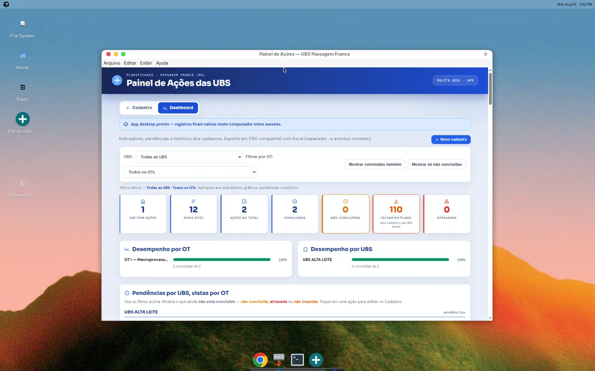

# Painel UBS Planifica

**Versão 3.1.1** · App desktop para o registro das ações das UBS — **PlanificaSUS · Passagem Franca (MA)**

<p align="center">
  
</p>


## Por que este projeto importa

Ferramenta **operacional de APS** (PlanificaSUS): as equipes registram e acompanham o plano de ações das UBS sem depender de planilha solta. Feita para rodar **offline no desktop Windows** (dados só na máquina — sem nuvem de pacientes).

### Destaques técnicos

- **Electron** + UI HTML/CSS/JS (app desktop instalável e **portable**)
- Dashboard com **KPIs, filtros UBS/OT, gráficos e pendências** sincronizados
- Cadastro guiado (UBS → eixo OT → ações → status em lote)
- **Export CSV** (Excel, `;` + acentos) e **backup JSON automático** a cada alteração
- Banco de eixos/ações do PlanificaSUS pré-carregado; sem backend/cloud no caminho crítico

> Ideal no portfólio junto ao [SIGAPS](https://github.com/ymedeiros228/sigaps): um sistema **web GIS territorial** + um painel **desktop do plano de ações**.

---


## O que é

Sistema simples e visual para as equipes das Unidades Básicas de Saúde acompanharem o plano de ações do PlanificaSUS:

- Cadastrar ações por **UBS** e **eixo (OT)**
- Classificar como **Concluída**, **Não concluída** ou **Atrasada**
- Ver indicadores, pendências e histórico no **Dashboard**
- Exportar CSV para Excel (backup)

Os dados ficam salvos **neste computador** (arquivo JSON + cópia em Documentos — sem nuvem automática).

---

## Funcionalidades

| Área | O que faz |
|------|-----------|
| **Cadastro** | Fluxo guiado: UBS → OT → multi-seleção de ações → status em lote |
| **Dashboard** | Cards de indicadores, gráficos por OT/UBS, pendências e histórico |
| **Filtros** | UBS e OT acima dos indicadores — os números acompanham a seleção |
| **Exportação** | CSV compatível com Excel (separador `;` e acentos corretos) |
| **Eixos (OTs)** | 12 eixos e ações-modelo pré-carregados; dá para editar/excluir |

---


## Download (Windows)

**Release mais recente:** veja [Releases](https://github.com/ymedeiros228/painel-ubs-planifica/releases) (arquivo **Portable** `.exe`).

- Windows 10/11 64 bits  
- Dados salvos localmente neste computador (sem nuvem)

### Manual de entrega

Documentação oficial (capa, prints, termo de aceite):

- Fonte: [`docs/manual/MANUAL_ENTREGA.md`](docs/manual/MANUAL_ENTREGA.md)
- PDF: [`docs/manual/PainelUBS_Manual_Entrega_Oficial.pdf`](docs/manual/PainelUBS_Manual_Entrega_Oficial.pdf)
- Regenerar: `npm run docs:manual`

## Como usar (Windows)

### Opção rápida — portátil (recomendado)

1. Baixe o **Portable** da release (`Painel UBS Planifica-*-Portable.exe` / ZIP)
2. Extraia numa pasta **fixa** (ex.: `Documentos\PainelUBS`) — não rode direto de Downloads
3. Execute o `.exe` — **não precisa instalar**
4. Mantenha o `.exe` e a pasta `painel-ubs-dados` juntos

> Requisitos: **Windows 10 ou 11 (64 bits)**

### Backup dos dados

A cada alteração o app grava automaticamente:

- pasta **Área de Trabalho\\Backup UBS Planifica\\** (fácil de achar)  
- `painel-dados.json` na pasta de dados do app  
- cópia em **Documentos\\PainelUBSPlanifica\\**  
- backup diário em `backups\\`

No Dashboard também há:

- **Backup na Área de Trabalho** — abre a pasta do backup  
- **Exportar backup JSON** — cópia completa para pen drive/rede  
- **Importar backup** — restaura a partir de um JSON  
- **Exportar CSV (Excel)** — planilha para Excel  

Guarde o JSON periodicamente em local seguro.

---

## Desenvolvimento

### Pré-requisitos

- Node.js **22+**
- npm

### Instalar e rodar

```bash
npm ci
npm start
```

### Empacotar para Windows

```bash
npm run dist
```

Gera instalador/portátil em `dist/` (o alvo principal do builder é Windows).

### Estrutura

```text
├── main.js          # Processo principal Electron
├── preload.js       # Bridge segura para o renderer
├── scripts/start.js # Launcher (D-Bus no Linux)
├── src/index.html   # Interface (Cadastro + Dashboard)
├── build/           # Ícones e LEIA-ME
└── docs/            # Imagens do README
```

---

## Novidades 3.1.1

- Arquivo JSON principal é a **fonte da verdade** (exclusões não voltam sozinhas ao reabrir)
- Gravação em fila + salvamento ao fechar a janela (`Ctrl+S` / fechar)
- Recuperação só com confirmação (cópias auxiliares / seed Alta Leite)
- Pasta **Área de Trabalho\\Backup UBS Planifica\\** alinhada ao estado atual + `ultimo-com-dados` para resgate

## Novidades 3.1.0

- **Backup automático** em JSON a cada cadastro/edição/exclusão
- Pasta **Área de Trabalho\\Backup UBS Planifica\\** sempre atualizada
- Espelho em `Documentos\PainelUBSPlanifica\` e, no Portable, pasta `painel-ubs-dados` ao lado do `.exe`
- Botões no Dashboard: exportar/importar backup JSON e abrir pasta dos dados
- Restauração dos registros recuperados da **UBS ALTA LEITE** (OT I)

## Novidades 3.0.1

- Filtros de **UBS** e **OT** no topo do Dashboard
- Indicadores, gráficos, pendências e histórico respeitam o filtro
- Botões de visibilidade lado a lado na barra de filtros
- Abertura mais estável (GPU/software raster)
- Electron e dependências atualizados (`npm audit` limpo)

---

## Sobre

- **Município:** Passagem Franca (MA)  
- **Programa:** PlanificaSUS  
- **Licença:** uso interno (não público / `UNLICENSED`)

Dúvidas de uso no dia a dia: veja também `build/LEIA-ME.txt` (incluído no ZIP da versão).
