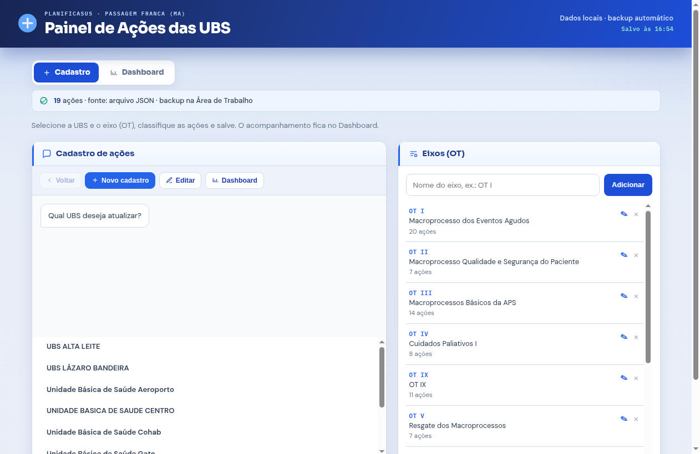
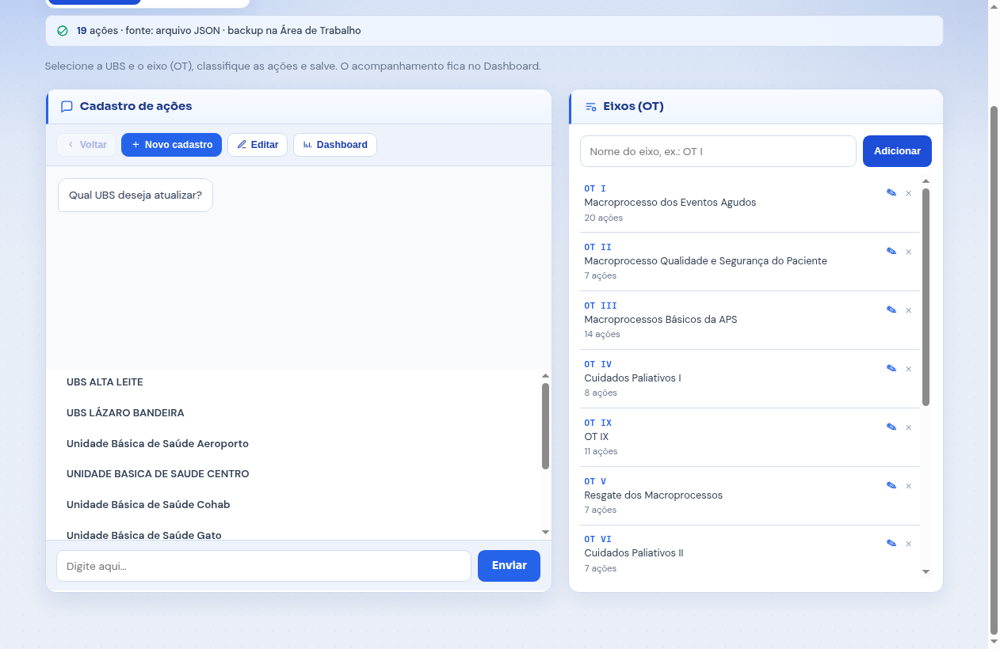
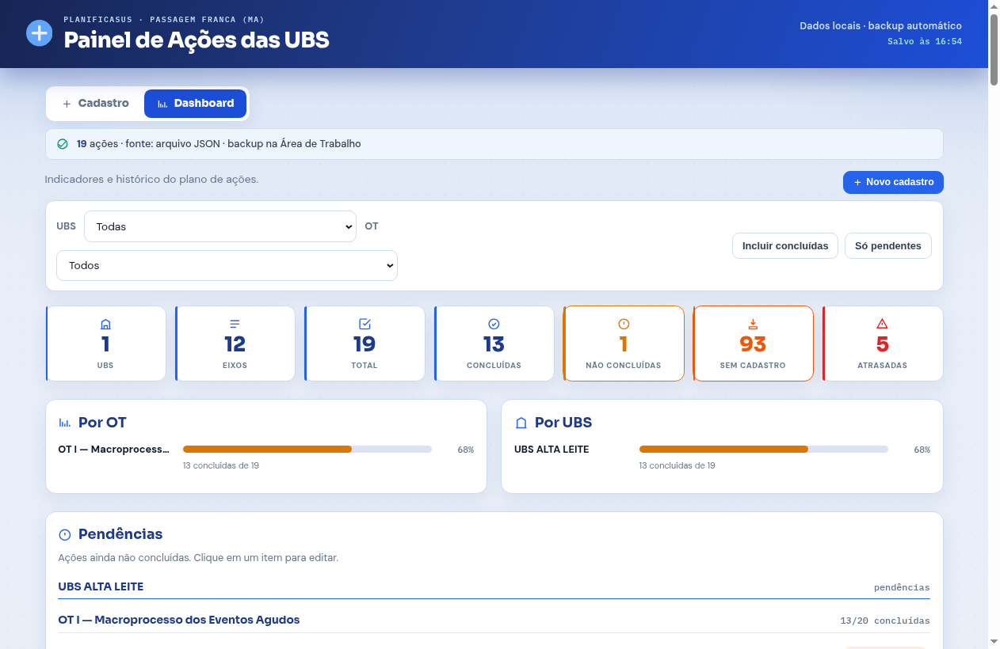
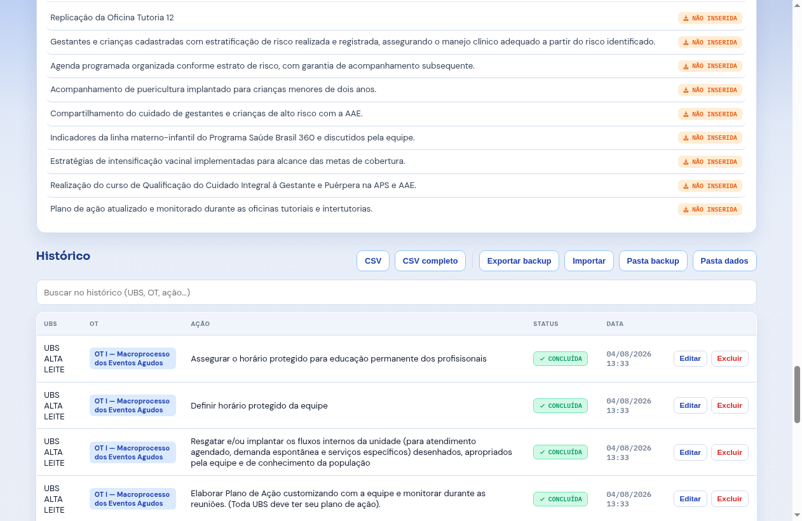

## Sumário

1. [Apresentação e objetivo](#1-apresentação-e-objetivo)
2. [Escopo da entrega](#2-escopo-da-entrega)
3. [Instalação e primeiro uso](#3-instalação-e-primeiro-uso)
4. [Cadastro de ações](#4-cadastro-de-ações)
5. [Eixos (OT) e banco PlanificaSUS](#5-eixos-ot-e-banco-planificasus)
6. [Dashboard — indicadores e pendências](#6-dashboard--indicadores-e-pendências)
7. [Histórico, busca e exclusão](#7-histórico-busca-e-exclusão)
8. [Backup automático e recuperação](#8-backup-automático-e-recuperação)
9. [Como usar no dia a dia](#9-como-usar-no-dia-a-dia)
10. [Dados locais, privacidade e segurança](#10-dados-locais-privacidade-e-segurança)
11. [Arquitetura técnica](#11-arquitetura-técnica)
12. [Suporte e cuidados de uso](#12-suporte-e-cuidados-de-uso)
13. [Termo de aceite e assinaturas](#13-termo-de-aceite-e-assinaturas)

**Este documento constitui o Manual Técnico e o Termo de Entrega e Aceite** entre o desenvolvedor **Yuri Medeiros Bandeira** e o cliente **Jonas Almeida Medeiros** (Enfermeiro da APS), referente ao aplicativo desktop **Painel UBS Planifica** (PlanificaSUS — Passagem Franca/MA), versão **3.1.1**.

---

# 1. Apresentação e objetivo

## 1.1 Contexto

No **PlanificaSUS**, as equipes das Unidades Básicas de Saúde acompanham um **plano de ações** organizado por eixos (OTs). No dia a dia, esse acompanhamento costuma ficar espalhado em planilhas, anotações e arquivos soltos — o que dificulta ver o que está concluído, atrasado ou ainda sem registro.

O **Painel UBS Planifica** concentra esse trabalho em um **aplicativo desktop para Windows**: cadastro guiado por UBS e OT, classificação de status, dashboard com indicadores e **backup automático em arquivo JSON**, sem depender de internet ou servidor na nuvem.

## 1.2 Destinatário deste manual

Este documento foi elaborado para **Jonas Almeida Medeiros**, enfermeiro da APS em Passagem Franca/MA, como referência oficial do software entregue. Contém descrição funcional, capturas de tela da aplicação, orientações de instalação e uso, regras de backup e o termo de aceite para homologação.

## 1.3 Objetivos do aplicativo

| Objetivo | Descrição |
|----------|-----------|
| **Registrar** | Cadastrar ações por UBS e eixo (OT) com status claro |
| **Acompanhar** | Ver indicadores, pendências e progresso no Dashboard |
| **Persistir** | Salvar automaticamente em JSON a cada alteração |
| **Proteger** | Manter cópias na Área de Trabalho e em Documentos |
| **Exportar** | Gerar CSV para Excel e backup JSON portátil |
| **Operar offline** | Funcionar sem internet após a instalação |

---

# 2. Escopo da entrega

## 2.1 Módulos entregues

| Módulo | Status | Descrição |
|--------|--------|-----------|
| Cadastro guiado | ✅ Entregue | Fluxo UBS → OT → ações → status em lote |
| Eixos (OT) | ✅ Entregue | 12 eixos PlanificaSUS pré-carregados; edição/exclusão |
| Dashboard | ✅ Entregue | KPIs, filtros UBS/OT, progresso, pendências |
| Histórico | ✅ Entregue | Tabela com busca, editar, excluir e desfazer |
| Backup automático | ✅ Entregue | JSON a cada alteração + pasta na Área de Trabalho |
| Importar / exportar | ✅ Entregue | Backup JSON e CSV (Excel) |
| Portable Windows | ✅ Entregue | Executável sem instalador (pasta fixa) |
| Recuperação guiada | ✅ Entregue | Modal de restauração quando não há arquivo principal |
| Seed Alta Leite | ✅ Entregue | Registros recuperados inclusos (com confirmação) |

## 2.2 Fora do escopo (evolução futura)

- Sincronização em nuvem ou multi-usuário simultâneo
- Aplicativo para celular (iOS/Android)
- Integração automática com e-SUS / planilhas oficiais do Ministério
- Login com senha (uso local exclusivo da equipe do cliente)

---

# 3. Instalação e primeiro uso

## 3.1 Requisitos

| Item | Valor |
|------|-------|
| **Sistema** | Windows 10 ou 11 (64 bits) |
| **Formato** | Portable (não precisa instalar) |
| **Internet** | Não obrigatória para o uso diário |
| **Espaço** | Poucos MB para o app + pasta de dados |

## 3.2 Como instalar (Portable)

**Passo 1.** Baixe o pacote da versão **3.1.1** (arquivo Portable / ZIP).

**Passo 2.** Extraia em uma pasta **fixa**, por exemplo:
`Documentos\PainelUBS`

**Importante:** não execute direto da pasta **Downloads** (o Windows pode limpar ou mover arquivos).

**Passo 3.** Abra o arquivo:
`Painel UBS Planifica-3.1.1-Portable.exe`

**Passo 4.** Mantenha juntos o `.exe` e a pasta `painel-ubs-dados` (criada automaticamente).

**Passo 5.** Na Área de Trabalho surgirá a pasta **Backup UBS Planifica** — atualizada sozinha a cada alteração.

## 3.3 Identidade na tela inicial

Ao abrir, o painel mostra a marca PlanificaSUS / Passagem Franca, o indicador **Salvo às HH:MM** e a navegação entre **Cadastro** e **Dashboard**.

Figura 1 — Tela de Cadastro (fluxo guiado + eixos OT)

**Dica:** na primeira abertura pode aparecer um aviso rápido sobre a pasta de backup. Clique em **Entendi**. Se o app abrir sem dados e existir cópia auxiliar, pode surgir a tela **Backup encontrado** — use **Restaurar backup** somente se fizer sentido.

## 3.4 Onde ficam os dados

| Local | Conteúdo |
|-------|----------|
| `{pasta do exe}\painel-ubs-dados\` | Arquivo principal `painel-dados.json` (fonte da verdade) |
| `Área de Trabalho\Backup UBS Planifica\` | Espelho + `painel-dados-ultimo-com-dados.json` |
| `Documentos\PainelUBSPlanifica\` | Espelho adicional |
| `painel-ubs-dados\backups\` | Cópias diárias (quando há ações) |

---

# 4. Cadastro de ações

## 4.1 Fluxo guiado

O cadastro acontece em etapas, como uma conversa:

1. Escolher a **UBS**
2. Escolher o **eixo (OT)**
3. Selecionar uma ou mais **ações**
4. Classificar o **status** (Concluída, Não concluída ou Atrasada)
5. Confirmar — o painel grava automaticamente

Botões úteis na barra do chat: **Voltar**, **Novo cadastro**, **Editar** e atalho para o **Dashboard**.

Figura 2 — Cadastro à esquerda e gestão de eixos (OT) à direita

## 4.2 Status disponíveis

| Status | Quando usar |
|--------|-------------|
| **Concluída** | Ação realizada e encerrada |
| **Não concluída** | Prevista, ainda em andamento |
| **Atrasada** | Prazo ultrapassado / precisa de atenção |

---

# 5. Eixos (OT) e banco PlanificaSUS

O painel já vem com os **12 eixos** do banco PlanificaSUS (OT I a OT XII) e as ações-modelo de cada eixo.

| Recurso | Comportamento |
|---------|---------------|
| **Adicionar** | Campo “Nome do eixo” + botão Adicionar |
| **Editar** | Ícone ✎ — atualiza o nome e os cadastros vinculados |
| **Excluir** | Ícone ✕ — remove o eixo; os registros de ações permanecem no histórico |

**Atenção:** excluir um eixo não apaga automaticamente o histórico de ações já cadastradas. Use exclusão de ações no Dashboard se quiser limpar registros pontuais.

---

# 6. Dashboard — indicadores e pendências

O Dashboard é a visão de acompanhamento do plano.

Figura 3 — Dashboard completo (filtros, KPIs, progresso e pendências)

## 6.1 Indicadores

| Indicador | Significado |
|-----------|-------------|
| **UBS** | Unidades com registro no filtro atual |
| **Eixos** | Quantidade de OTs |
| **Total** | Ações cadastradas |
| **Concluídas** | Status concluída |
| **Não concluídas** | Em aberto |
| **Sem cadastro** | Ações-modelo ainda não inseridas |
| **Atrasadas** | Status atrasada |

## 6.2 Filtros

- Filtro por **UBS** e por **OT**
- Alternar **Incluir concluídas** / **Só pendentes**
- Os números, gráficos e listas acompanham o filtro

Figura 4 — Filtros UBS/OT e cartões de indicadores

## 6.3 Pendências

A seção **Pendências** lista o que ainda não está concluído. Clique em um item para editar o cadastro correspondente.

---

# 7. Histórico, busca e exclusão

No final do Dashboard fica o **Histórico** completo.

Figura 5 — Histórico, busca e botões de backup / CSV

| Recurso | Uso |
|---------|-----|
| **Busca** | Filtra por UBS, OT ou texto da ação |
| **Editar** | Reabre o cadastro para correção |
| **Excluir** | Remove a ação (com opção **Desfazer** por alguns segundos) |
| **CSV / CSV completo** | Exporta planilha para Excel |
| **Ctrl+S** | Força um backup imediato |

**Integridade:** o arquivo JSON principal é a fonte da verdade. Se você excluir uma ação e o painel mostrar **Salvo às HH:MM**, ao reabrir o aplicativo a exclusão **permanece** — não “volta sozinha”.

---

# 8. Backup automático e recuperação

## 8.1 O que o app grava sozinho

A cada cadastro, edição ou exclusão o painel atualiza:

1. `painel-dados.json` (principal)
2. Pasta **Área de Trabalho → Backup UBS Planifica**
3. Espelho em **Documentos → PainelUBSPlanifica**
4. Quando há dados: `painel-dados-ultimo-com-dados.json` e backup do dia

O topo da tela exibe **Salvo às HH:MM** quando a gravação conclui.

## 8.2 Botões no Dashboard

| Botão | Função |
|-------|--------|
| **Exportar backup** | Salva uma cópia JSON escolhida por você (pen drive / rede) |
| **Importar** | Mescla um JSON de backup com os dados atuais (com confirmação) |
| **Pasta backup** | Abre a pasta da Área de Trabalho |
| **Pasta dados** | Abre a pasta interna `painel-ubs-dados` |

## 8.3 Se algo sumir

**Passo 1.** Se aparecer **Backup encontrado**, leia o resumo e clique em **Restaurar backup** se for o arquivo certo.

**Passo 2.** Ou use **Importar** e escolha, nesta ordem de preferência:
1. `painel-dados-ultimo-com-dados.json`
2. `painel-dados.json`
3. `painel-dados-anterior.json`

**Passo 3.** Confirme a quantidade de ações antes de mesclar.

**Boas práticas:** copie periodicamente a pasta **Backup UBS Planifica** para pen drive. Não apague essa pasta. Não separe o `.exe` da pasta `painel-ubs-dados`.

---

# 9. Como usar no dia a dia

Fluxo sugerido para o enfermeiro APS / responsável pelo plano:

**Passo 1 — Abrir o painel**  
Execute o Portable na pasta fixa. Confira o indicador **Salvo às …**.

**Passo 2 — Registrar o que aconteceu na UBS**  
Em **Cadastro**, escolha UBS → OT → ações → status → confirme.

**Passo 3 — Revisar pendências**  
No **Dashboard**, filtre a UBS e veja **Pendências** e o progresso por OT.

**Passo 4 — Ajustar o que mudou**  
No **Histórico**, busque a ação, edite ou exclua (use **Desfazer** se errou).

**Passo 5 — Fechar com tranquilidade**  
Pode fechar a janela normalmente; o app também tenta gravar ao sair. Para forçar: **Ctrl+S**.

**Passo 6 — Exportar quando precisar reportar**  
Use **CSV** para Excel ou **Exportar backup** para arquivo completo.

**Atalhos úteis**

| Ação | Como |
|------|------|
| Forçar backup | `Ctrl+S` |
| Ir ao Dashboard | Aba **Dashboard** ou botão no cadastro |
| Novo cadastro | Botão **+ Novo cadastro** |

---

# 10. Dados locais, privacidade e segurança

| Tema | Comportamento |
|------|----------------|
| **Armazenamento** | Somente neste computador (arquivos JSON) |
| **Nuvem** | Não há envio automático para servidor |
| **Login** | Não há tela de senha — uso local da equipe |
| **Conteúdo** | Registro operacional do plano de ações (não é prontuário clínico) |
| **Cópia** | Responsabilidade do usuário manter pen drive / pasta segura |

O painel foi desenhado para **uso interno** da APS de Passagem Franca/MA no contexto PlanificaSUS. Não publique o executável nem os JSON em repositórios públicos sem revisão.

---

# 11. Arquitetura técnica

| Camada | Tecnologia |
|--------|------------|
| **Shell desktop** | Electron 39 |
| **Interface** | HTML / CSS / JavaScript (página única) |
| **Persistência** | Arquivo JSON + espelhos (userData, Documentos, Desktop) |
| **Empacotamento** | electron-builder (NSIS + Portable Windows x64) |
| **Sistema-alvo** | Windows 10/11 64 bits |
| **Versão entregue** | **3.1.1** |

## 11.1 Repositório

Código-fonte do projeto: [github.com/ymedeiros228/painel-ubs-planifica](https://github.com/ymedeiros228/painel-ubs-planifica)

---

# 12. Suporte e cuidados de uso

## 12.1 Cuidados que evitam dor de cabeça

| Situação | O que fazer |
|----------|-------------|
| App na pasta Downloads | Mover para pasta fixa (Documentos) |
| Trocar de computador | Copiar `.exe` + `painel-ubs-dados` + pasta Backup |
| Abriu “vazio” | Restaurar / Importar o JSON da Área de Trabalho |
| Quarentena do Windows | Liberar o Portable (SmartScreen) se solicitado |
| Atualizar versão | Preferir extrair a nova versão na **mesma pasta** ou migrar a pasta de dados |

## 12.2 Contato do desenvolvedor

| | |
|---|---|
| **Desenvolvedor** | Yuri Medeiros Bandeira |
| **Função** | Programador / responsável técnico |
| **Cliente** | Jonas Almeida Medeiros — Enfermeiro APS |
| **Município** | Passagem Franca — Maranhão |
| **Data da entrega** | 04 de agosto de 2026 |
| **Versão do sistema** | Painel UBS Planifica **3.1.1** |
| **Repositório** | https://github.com/ymedeiros228/painel-ubs-planifica |

---

# 13. Termo de aceite e assinaturas

**TERMO DE ENTREGA E ACEITE — PAINEL UBS PLANIFICA** — Documento oficial que formaliza a entrega técnica da versão **3.1.1** e o recebimento pelo cliente abaixo identificado.

## 13.1 Declaração de entrega

Declaro que o aplicativo **Painel UBS Planifica** — registro do plano de ações das UBS no âmbito do **PlanificaSUS**, município de **Passagem Franca — Maranhão**, versão **3.1.1**, foi desenvolvido, documentado e entregue em formato **Portable para Windows**, atendendo aos módulos descritos nas seções 2 a 12 deste manual, incluindo cadastro guiado, dashboard, histórico, exportações e backup automático em arquivo JSON.

## 13.2 Termo de recebimento

O cliente abaixo identificado declara ter recebido o aplicativo, revisado as funcionalidades descritas neste manual, testado a aplicação no ambiente Windows e estar ciente de que os dados permanecem **locais neste computador**, com cópias de segurança na pasta **Backup UBS Planifica** e nos demais locais indicados na seção 3.4.

---

### CLIENTE / RECEPTOR

| Campo | Informação |
|-------|------------|
| **Nome completo** | Jonas Almeida Medeiros |
| **Função** | Enfermeiro da APS |
| **Órgão** | Secretaria Municipal de Saúde — Passagem Franca/MA |
| **Data do recebimento** | ____ / ____ / ________ |

**Assinatura:**

**Jonas Almeida Medeiros**  
Enfermeiro — Atenção Primária à Saúde  
Secretaria Municipal de Saúde de Passagem Franca/MA

---

### DESENVOLVEDOR / ENTREGADOR TÉCNICO

| Campo | Informação |
|-------|------------|
| **Nome completo** | Yuri Medeiros Bandeira |
| **Função** | Programador / Desenvolvedor do Painel UBS Planifica |
| **Repositório** | https://github.com/ymedeiros228/painel-ubs-planifica |
| **Data da entrega** | 04 de agosto de 2026 |

**Assinatura:**

**Yuri Medeiros Bandeira**  
Desenvolvedor — Painel UBS Planifica  
PlanificaSUS · Passagem Franca/MA

---

## 13.3 Observações finais

| Item | Detalhe |
|------|---------|
| **Validade** | Este termo vale como registro de entrega da versão 3.1.1 |
| **Backup** | A pasta Desktop **Backup UBS Planifica** faz parte da operação diária |
| **Suporte** | Dúvidas de uso: seções 3 a 9 deste manual |
| **Versão do documento** | 1.0 — 04/08/2026 |

---

*Fim do documento — Painel UBS Planifica · Manual de Entrega Oficial v1.0*
